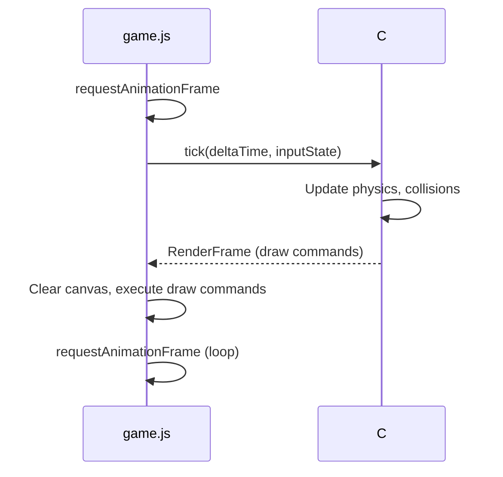
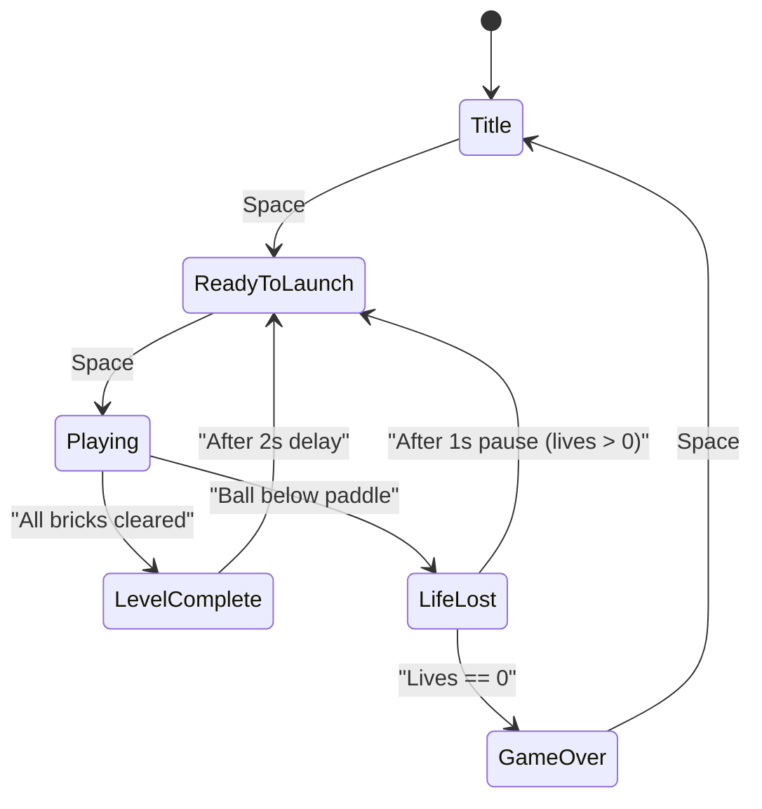

# Breakout Game Specification

## Overview

A single-player Breakout arcade clone built as a Blazor Standalone WebAssembly application (.NET 10). The player controls a horizontal paddle to bounce a ball into rows of colored bricks. Bricks are damaged or destroyed on hit, awarding points. Clearing all bricks advances to the next level. The game should feel polished and professionally presented.

The existing project ([BreakoutGame.csproj](BreakoutGame.csproj)) is a .NET 10 Blazor WASM standalone app with Bootstrap 5, a placeholder `<canvas>` on [Pages/Home.razor](Pages/Home.razor), and no game logic yet.

---

## Technical Architecture

### Rendering: HTML5 Canvas via JS Interop

Blazor WASM cannot draw to `<canvas>` directly. All rendering must go through JavaScript interop.

- **JS module** (`wwwroot/js/game.js`): Exposes functions to draw rectangles, circles, text, and to clear the canvas. Also handles `requestAnimationFrame` to drive the render/update loop and keyboard event listeners.
- **C# game engine**: Owns all game state, physics, and collision logic. Exposes `[JSInvokable]` methods called each frame from JS to advance the simulation and return a render command list (or update state that JS reads).
- **Keyboard input**: JS listens for `keydown`/`keyup` on `ArrowLeft` and `ArrowRight` (and optionally `A`/`D`), forwards pressed state to C# via interop.

### Recommended Game Loop Flow



### Project Structure (new files)

```
BreakoutDotNet/
  Pages/
    Home.razor              -- updated: hosts canvas, initializes game
  Models/
    GameState.cs            -- top-level state: score, lives, level, status
    Ball.cs                 -- position, velocity, radius
    Paddle.cs               -- position, width, height, speed
    Brick.cs                -- position, size, color, hit points, point value
    Level.cs                -- brick layout definition
    InputState.cs           -- keyboard state (left/right pressed)
    Particle.cs             -- optional: particle effect data
  Services/
    GameEngine.cs           -- core loop logic: update, collision, level mgmt
    CollisionService.cs     -- AABB and circle-rect collision detection
    LevelService.cs         -- builds brick layouts for each level
    ScoringService.cs       -- score tracking, combo/multiplier logic
  Interop/
    GameInterop.cs          -- IJSRuntime wrapper for canvas draw calls
  wwwroot/
    js/game.js              -- canvas rendering, rAF loop, input capture
    css/app.css             -- updated: game-specific styles
    audio/                  -- optional: sound effect files
```

---

## Game Objects

### Canvas

- **Dimensions**: 800 x 600 pixels (logical), scaled responsively within the page
- **Background**: Dark gradient or solid dark color (#1a1a2e or similar) for contrast
- **Border**: Subtle rounded border with glow effect

### Paddle

- **Size**: 100px wide x 14px tall (default); width may change with power-ups in future
- **Position**: Fixed 30px above canvas bottom, moves horizontally only
- **Speed**: 500px/s (tuned for responsive feel)
- **Appearance**: Rounded rectangle with gradient fill (bright cyan/blue), subtle glow/shadow
- **Clamping**: Cannot move beyond left/right canvas edges
- **Controls**: Left Arrow = move left, Right Arrow = move right. Hold to move continuously. Support A/D as alternative keys.

### Ball

- **Size**: 8px radius
- **Starting position**: Resting centered on top of the paddle before launch
- **Launch**: Press Spacebar to launch at a slight upward-left or upward-right angle (randomized)
- **Speed**: Initial 350px/s, increasing slightly (+5%) with each level
- **Appearance**: White or bright circle with a subtle glow trail
- **Physics**:
  - Reflects off top wall, left wall, right wall (angle of incidence = angle of reflection)
  - Reflects off paddle: bounce angle varies based on where the ball hits the paddle (center = straight up, edges = sharper angles, up to ~60 degrees from vertical)
  - Falls below the paddle = lose a life
  - Reflects off bricks: standard reflection on the face hit

### Bricks

Each brick is a rounded rectangle, **60px wide x 20px tall**, arranged in a grid with 2px gaps.

| Color | HP | Points per Hit | Points on Break | Visual |
|-------|-----|----------------|-----------------|--------|
| Green | 1 | -- | 10 | Solid green, breaks in one hit |
| Yellow | 1 | -- | 20 | Solid yellow, breaks in one hit |
| Orange | 2 | 10 | 30 | Orange, cracks appear after first hit (becomes dimmer) |
| Red | 2 | 10 | 50 | Red, cracks appear after first hit |
| Purple | 3 | 10 | 100 | Purple, shows progressive damage (2 damage states) |
| Silver | 4 | 10 | 200 | Metallic/silver, shows progressive damage (3 damage states) |

- When a multi-HP brick is hit, it visually changes (dimmer shade, crack overlay, or shifted hue) to indicate damage
- When a brick breaks, a brief particle burst or flash effect plays at the brick's location

### Walls

- Top, left, and right edges of the canvas are solid walls
- Bottom edge is open (ball loss zone)

---

## Scoring

- **Display**: Upper-right corner of the canvas, white text, clean sans-serif font, ~18px
- **Format**: `Score: 00000` (zero-padded or plain integer)
- Points awarded per the brick table above
- Future consideration: combo multiplier for consecutive hits without paddle contact (not required for v1)

---

## Lives

- **Starting lives**: 3
- **Display**: Upper-left corner of the canvas, shown as small ball icons or `Lives: 3`
- **On life lost**: Brief pause (1s), ball resets to paddle, paddle resets to center
- **Game Over**: When lives reach 0, display "GAME OVER" overlay with final score and "Press Space to Restart" prompt

---

## Levels

### Level Structure

Each level defines a 2D grid of bricks (up to ~13 columns x 8-10 rows to fit the 800px canvas width with spacing). `null` entries in the grid represent empty spaces.

### Level Progression

- **Level 1**: Simple 3-row layout of green and yellow bricks (easy introduction)
- **Level 2**: 5 rows mixing green, yellow, and orange bricks
- **Level 3**: 6 rows with a pattern (diamond, pyramid, or chevron) using green through red
- **Level 4**: Full 8-row grid introducing purple bricks, with some gaps forming a pattern
- **Level 5**: Dense grid with silver bricks in the top row, pattern of all colors
- **Additional levels**: Repeat with increasing ball speed (+5% per level) and denser/harder layouts. After level 5, cycle back to patterns with increased difficulty.

### Level Transition

1. When all bricks are cleared, ball and paddle freeze
2. Display "LEVEL COMPLETE" text centered on canvas with current score
3. After a 2-second delay, load next level, reset ball to paddle, game continues
4. Brief fade-in animation for new bricks appearing

---

## Game States



- **Title**: Show game title "BREAKOUT" with "Press Space to Start" prompt. Optionally show a demo/attract animation.
- **ReadyToLaunch**: Ball sits on paddle, paddle movable. Waiting for Space press.
- **Playing**: Full game loop active.
- **LevelComplete**: Freeze gameplay, show level complete message, auto-advance.
- **LifeLost**: Brief freeze, decrement lives, transition.
- **GameOver**: Show final score, prompt to restart.

---

## Visual Polish Requirements

### General Aesthetic
- Dark, slightly blue-tinted background for the game area
- All game objects should have subtle drop shadows or glow effects
- Smooth 60fps rendering via requestAnimationFrame
- Anti-aliased shapes (use canvas arc for ball, roundRect for bricks/paddle)

### Effects
- **Brick break**: Brief white flash + 4-8 small particles that fade out over ~300ms
- **Wall bounce**: Subtle brief screen-edge flash
- **Paddle hit**: Brief paddle brightening/pulse
- **Level complete**: Text scales in with a brief ease-out animation
- **Game over**: Text fades in, slight red tint overlay

### Typography
- Score/lives HUD: Clean, bold, sans-serif (use canvas font: `"bold 18px 'Segoe UI', sans-serif"`)
- Title screen: Large bold text (48px), subtitle smaller (20px)
- All text should have a subtle text shadow for readability against the dark background

### Page Layout
- The canvas should be centered on the page
- Remove or simplify the default Blazor template sidebar/nav for the game page
- Minimal chrome around the canvas -- the game should be the focus
- The page background outside the canvas should be dark to complement the game

---

## Controls Summary

| Key | Action |
|-----|--------|
| Arrow Left / A | Move paddle left |
| Arrow Right / D | Move paddle right |
| Spacebar | Launch ball / Start game / Restart after game over |

- Keyboard input must work immediately without clicking the canvas (auto-focus or document-level listeners)
- Prevent default browser scrolling behavior for arrow keys and spacebar while game is active

---

## Non-Goals (v1)

These are explicitly out of scope for the initial implementation:

- Power-ups / power-downs
- Multi-ball
- Sound effects and music
- High score persistence (localStorage)
- Mobile / touch controls
- Multiplayer
- Level editor

---

## Implementation Notes

- All game state and logic lives in C#. JavaScript is only responsible for rendering to canvas and forwarding input.
- Use `IJSRuntime.InvokeAsync` / `InvokeVoidAsync` for C# to JS calls. Use `DotNetObjectReference` and `[JSInvokable]` for JS to C# callbacks.
- The game JS module should be loaded via `IJSRuntime.InvokeAsync<IJSObjectReference>("import", "./js/game.js")`.
- Collision detection should use circle-vs-AABB for ball-brick and ball-paddle checks.
- Delta time should be capped (e.g., max 50ms) to prevent tunneling after tab-away.
- The canvas should use `window.devicePixelRatio` scaling for crisp rendering on HiDPI displays.
