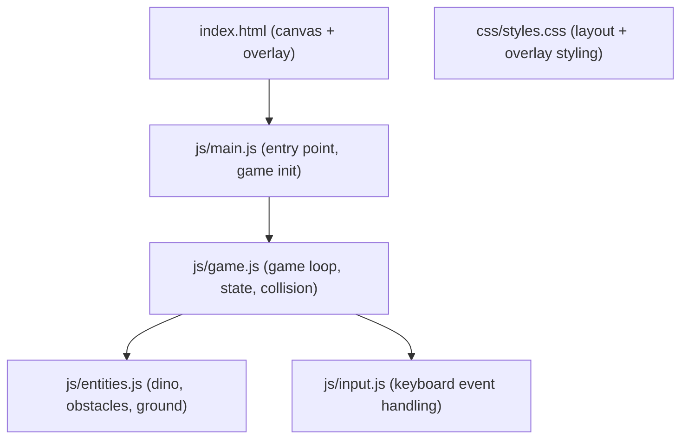

# Dino Runner Side-Scrolling Game

## Architecture

The game will use an HTML5 Canvas for rendering and draw emoji/text characters for all sprites. The existing starter code will be replaced entirely.

## File Changes

### [index.html](index.html) - Complete Rewrite
- Remove all starter content (header, cards, footer)
- Add a full-viewport `<canvas id="game-canvas">` element
- Add a score display overlay (top-right, positioned over canvas)
- Add a game-over overlay (centered, shows final score + "Play Again" button)
- Add a start screen overlay ("Press Space to Start")
- Keep the `<script type="module">` import pointing to `js/main.js`

### [css/styles.css](css/styles.css) - Complete Rewrite
- Reset/normalize styles for full-viewport canvas
- **Synthwave dark mode palette**:
  - Background: deep navy/dark purple (`#0d0221` or `#1a0533`)
  - Neon accent colors: hot pink (`#ff2975`), electric cyan (`#00fff9`), neon purple (`#b537f2`), warm yellow (`#ffd319`)
  - Text glow effects via `text-shadow` with neon colors
  - Button borders and overlays use neon pink/cyan with glow
- Style the score display (monospace font, top-right, neon cyan text with glow shadow)
- Style the game-over overlay (centered, dark semi-transparent backdrop with neon border, glowing "GAME OVER" text, neon-styled restart button)
- Style the start screen with pulsing neon title

### [js/main.js](js/main.js) - Complete Rewrite
- Import and initialize the Game class
- Wire up DOM elements (canvas, overlays, button)
- Call `game.start()` on user interaction

### [js/game.js](js/game.js) - New Module (replaces appState.js)
- **Game loop**: `requestAnimationFrame`-based loop with delta-time calculation
- **State machine**: `idle` -> `running` -> `gameOver`
- **Progressive difficulty**: base scroll speed starts at ~300px/s, increases by ~10px/s every 5 seconds, capped at ~800px/s
- **Obstacle spawning**: random intervals (decreasing over time) spawn either a ground obstacle or an air obstacle
- **Collision detection**: axis-aligned bounding box (AABB) checks between dino hitbox and obstacle hitboxes
- **Score**: elapsed seconds since game start, displayed with 1 decimal place
- **Rendering**: clear canvas each frame with dark synthwave background, draw neon ground line, dino, obstacles, optional stars/scenery
- **Synthwave visuals on canvas**:
  - Background: dark gradient (deep purple to navy)
  - Ground line: neon pink or cyan horizontal line with glow (drawn via `shadowBlur`/`shadowColor`)
  - Score text rendered in neon cyan with glow
  - Optional: distant horizon grid lines (perspective vanishing point) for retro 80s feel

### [js/entities.js](js/entities.js) - New Module
- **Dino**: position, velocity, gravity, jump logic
  - Rendered as a large emoji character (e.g. "🦖") using `ctx.fillText()`
  - Jump: apply upward velocity (-600px/s), gravity pulls back down (+1800px/s^2)
  - Hitbox: slightly smaller than visual bounding box for forgiving collisions
- **Obstacle (ground)**: cactus emoji "🌵", spawns at ground level, scrolls left
- **Obstacle (air)**: bird emoji "🦅", spawns at a height the dino would collide with mid-jump, scrolls left
- **Ground**: a horizontal line or dashed pattern at the dino's feet

### [js/input.js](js/input.js) - New Module
- Listen for `keydown` on Space and ArrowUp
- Expose an `isJumpPressed()` or event-driven approach
- Prevent default on Space to avoid page scroll
- Support both keyboard and the "Play Again" button for restart

## Game Mechanics

- **Dino always runs right** (visually stationary, world scrolls left)
- **Jump**: Space or ArrowUp; only while grounded (no double-jump)
- **Obstacles**: randomly chosen between ground (🌵) and air (🦅); air obstacles appear at ~60% of max jump height so the player must time jumps or duck (or simply not jump)
- **Collision**: if dino's hitbox overlaps any obstacle's hitbox, game ends
- **Score**: seconds survived, shown top-right (e.g., "12.3s")
- **Game Over**: freeze frame, show overlay with score and "Play Again" button; Space/Enter also restarts
- **Progressive difficulty**: speed ramps up, obstacle spawn interval decreases

## Existing Files to Delete

- [js/appState.js](js/appState.js) - no longer needed (game logic replaces it)

## Tests

- [tests/example.test.js](tests/example.test.js) - rewrite to test game utility functions (e.g., collision detection, score formatting, entity creation) that don't depend on canvas/DOM

## Canvas Sizing

- Canvas fills the browser viewport (`width: 100vw; height: 100vh`)
- On resize, update canvas width/height attributes to match `window.innerWidth` / `window.innerHeight`
- Ground level set at ~85% of canvas height

## Visual Theme: Synthwave Dark Mode

The entire game uses a fluorescent synthwave aesthetic:

- **Canvas background**: vertical gradient from deep purple (`#0d0221`) at the top to dark navy (`#1a1a2e`) at the bottom
- **Ground line**: glowing neon pink (`#ff2975`) with `shadowBlur: 15` for bloom effect
- **Score text**: neon cyan (`#00fff9`) with glow, monospace font
- **Overlays (start/game-over)**: dark translucent panels with neon-bordered edges, glowing heading text
- **Buttons**: dark fill with neon pink border and glow on hover
- **Optional flair**: small "stars" or dots in the sky area using neon purple/yellow, a subtle retro horizon grid behind the ground
