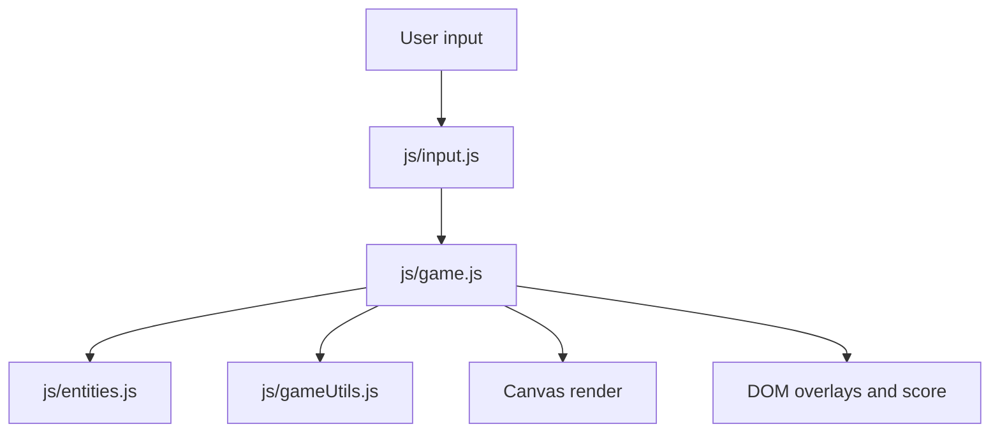

# Architecture

This repository is a **static web application**: a synthwave-themed dinosaur runner rendered on HTML5 Canvas with vanilla JavaScript (ES modules). There is **no bundler** and **no compile step** required to run the game in a browser.

## File map

- [`index.html`](../index.html): Page shell — full-viewport canvas, score HUD, start and game-over overlays.
- [`css/styles.css`](../css/styles.css): Synthwave dark-mode UI (neon overlays, score display, buttons).
- [`js/main.js`](../js/main.js): Browser entry — wires DOM elements and starts the `Game`.
- [`js/game.js`](../js/game.js): Game loop, state machine (`idle` → `running` → `gameOver`), spawning, collision, scoring.
- [`js/entities.js`](../js/entities.js): Dino, obstacles, background/grid rendering.
- [`js/input.js`](../js/input.js): Keyboard handling (jump, start, restart).
- [`js/gameUtils.js`](../js/gameUtils.js): Pure helpers (collision, score format, difficulty curves) — unit-tested without canvas.

## Data flow

## Game loop

1. `requestAnimationFrame` drives the loop with delta-time clamping.
2. While **running**: update dino physics, scroll obstacles, spawn new obstacles, check AABB collisions, update score (elapsed seconds).
3. Each frame: draw synthwave background (gradient, stars, horizon grid), neon ground line, emoji sprites.
4. **Progressive difficulty**: scroll speed ramps every ~5 seconds; spawn interval ramps every ~6 seconds (desynced to smooth mid-game spikes). Spawn jitter is tighter between 20–40s.

## Emoji sprites and facing

Sprites are Unicode emoji drawn with `ctx.fillText` in [`js/entities.js`](../js/entities.js). That keeps the demo asset-free, but emoji **do not share a consistent “forward” direction** across glyphs or platforms.

For a runner that moves right, the dinosaur must **face right**. The `🦖` glyph typically faces **left** in common fonts, which reads as running backward. `Dino.draw` therefore mirrors the glyph on the X axis (`translate` → `scale(-1, 1)` → `fillText`) before restoring the context. Obstacles without a clear travel direction (🌵) or that already read correctly (🦅 on current targets) are left unflipped.

See [Style guide — Canvas emoji sprites](./styleguide.md#canvas-emoji-sprites) for the convention table and the flip snippet to reuse when adding new directional sprites.

## Serving models

### Open as a file (`file://`)

Works for this demo. Modern browsers support same-folder ES modules from `file://`.

### Local static server (`http://localhost`)

Use when you hit module/CORS edge cases or want stable URLs for testing. See [Getting started](./gettingstarted.md).

## Testing

Tests in [`tests/`](../tests/) import `gameUtils.js` only — collision, score formatting, and difficulty helpers run in Node via Vitest without a canvas.

## Extension ideas

- Ducking for low obstacles
- High-score persistence via `localStorage`
- Sound effects (Web Audio API)
- Touch controls for mobile
