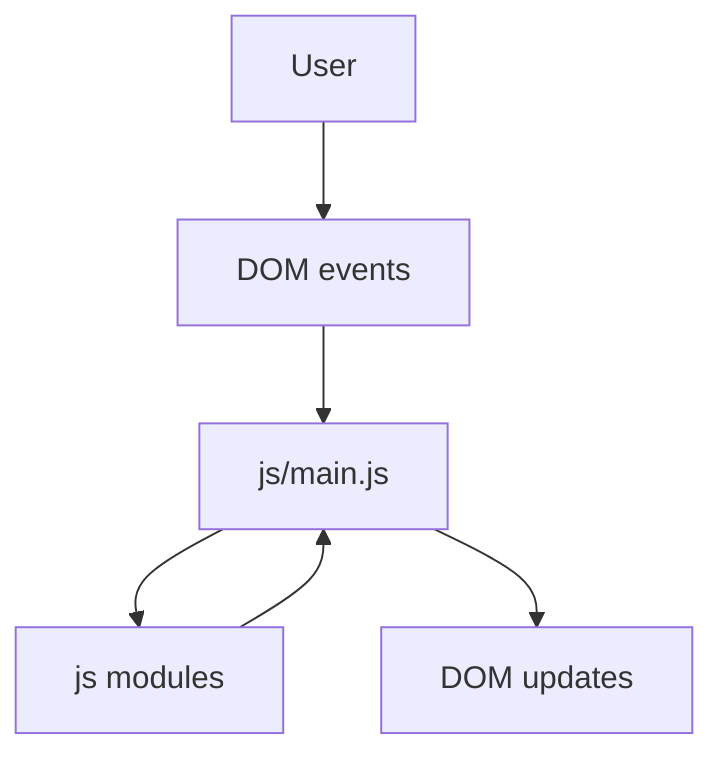

# Architecture

This repository is a **static web application**: HTML for structure, CSS for presentation, and JavaScript (ES modules) for behavior. There is **no bundler** and **no compile step** required to run the app in a browser.

## File map

- [`index.html`](../index.html): The single page shell. Keep this file mostly declarative (markup + references to assets).
- [`css/styles.css`](../css/styles.css): Global styles, layout primitives, and design tokens (CSS variables).
- [`js/main.js`](../js/main.js): Browser entry module. Responsible for wiring DOM events and rendering updates.
- [`js/appState.js`](../js/appState.js): Small, test-friendly modules. Prefer putting “business rules” and reusable logic here (or in additional modules) so it stays easy to test.

## Data flow (starter)

As your workshop app grows, keep the same idea: **thin UI wiring** in `main.js`, **richer logic** in modules.

## Serving models

### Open as a file (`file://`)

This works well for many static demos. Modern browsers generally support loading **same-folder ES modules** from `file://`.

### Local static server (`http://localhost`)

Use a static server when:

- you hit a browser edge case with modules from `file://`
- you add `fetch()` calls that are sensitive to origin/CORS
- you want stable URLs for screenshots, pairing, or automated browser tests

See [Getting started](./gettingstarted.md) for the optional `npm run start` path.

## Testing

Automated tests live in [`tests/`](../tests/) and run in Node via Vitest. Tests import the same ES modules the browser loads, which keeps logic honest and refactor-friendly.

## Where teams usually extend

- **UI**: add sections/components in `index.html`, style in `css/styles.css` (or split CSS files if the app grows).
- **Behavior**: add modules under `js/` and import them from `main.js`.
- **Persistence**: if you need storage, prefer `localStorage` for simple demos; document any constraints in your README.
